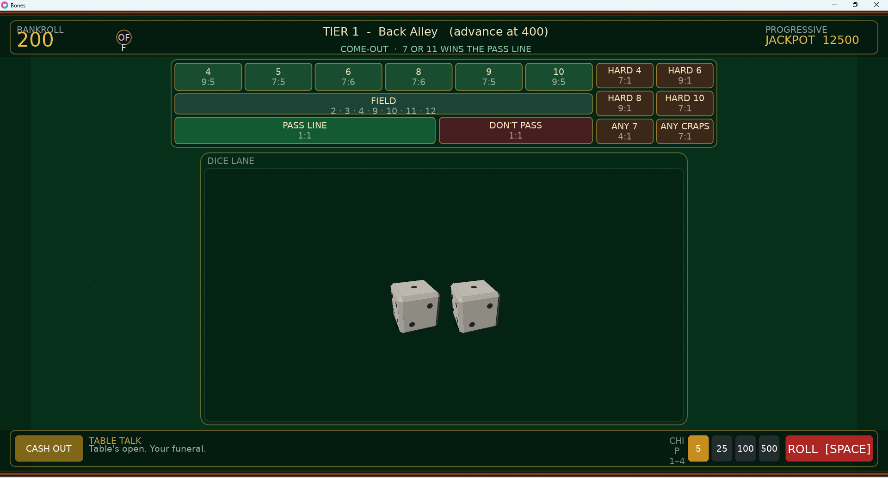

# Bones — a dice gambling game (LÖVE 11.5)



A juicy, fast dice gambler built on a simplified craps engine. Four modes:

- **Solo Run (PvE)** — climb escalating tiers against the AI House. Skill-modifier
  dice shift the odds in your favor *here only*. Bust ends the run; you keep a cut.
  Consecutive wins build a **fever chain** (up to +100% payouts).
- **The Boneyard (Battle Royale)** — craps as combat: 8 rollers, everyone's dice
  face-up, everyone has HP. Naturals hit your target, craps rolls backfire,
  point-breaks nuke, seven-outs self-destruct. Damage **multiplier chains**, kill
  bounties, 2 random **mutators** per match, and "The Rake" storm that forces an
  ending. Last bones standing takes 60% of the pot.
- **Ranked (PvP)** — host-authoritative tables, fair verifiable dice, ELO-ish rating.
- **Casual** — private lobby, host sets the rules, session chips only.

There's a **HOW TO PLAY** tab in the menu: craps 101 with live practice dice, every
bet with payouts (generated from the config), and guides for each mode.

The match table is responsive down to 960x540. Dice travel through a dedicated
lane instead of crossing controls; hover any bet for a plain-English rule,
watch recent totals in the lane header, and change dice animation speed in
Settings.

**Play money only.** No real-money anything. All currency is in-game "Chips."

## Run it

```
love .
```

from this directory (LÖVE 11.5). No global Lua libraries needed — everything is
vendored in `lib/` (hump, flux, bitser, sock, anim8).

The game is fully playable offline: the Steam layer (`src/steam/steam.lua`)
no-ops with a console warning when Steam isn't running.

Controls: **mouse** to pick chips and click bet spots on the felt, **1–4** to
pick a chip denomination, **SPACE** to roll, **ESC** to cash out / leave.
Gamepad: A = roll, B = back.

## Tests

Headless engine tests (no LÖVE required, any Lua 5.1+/LuaJIT):

```
lua tests/engine_test.lua
lua tests/dice_render_test.lua
lua tests/hud_layout_test.lua
```

Covers every bet's payout with rigged deterministic dice, phase transitions,
jackpot triggers, table limits, plus a 300k-roll statistical check of the Pass
Line house edge against the theoretical 1.414%. There's also
`lua tests/br_test.lua` — full seeded Boneyard matches, mutators, chain math,
payouts, AI-targeting spread regression, and the PvE fever chain. The renderer
test verifies the projected 3D cube geometry, ballistic tumble, physical
face-up result detection, full-tray translation, and authoritative six-face
settle without a forced-orientation snap, image assets, or a browser runtime.
The HUD test checks region separation and complete control/dice containment at
the supported minimum, both reported screenshot sizes, default, 720p, and 1080p.

## Building for Steam

1. Zip the project contents (not the folder) as `bones.love`.
2. Windows: `copy /b love.exe+bones.love bones.exe`, ship with LÖVE's DLLs.
3. Drop `luasteam.dll` + `steam_api64.dll` next to the exe and a
   `steam_appid.txt` with your app id for testing.
4. Steamworks: create achievements matching the ids in `src/meta/rewards.lua`,
   leaderboards `ranked_rating` + `biggest_single_win`, and enable Auto-Cloud
   on the LÖVE save directory (`%APPDATA%/LOVE/bones` on Windows).

## Where things live

| Path | What |
|---|---|
| `src/core/config.lua` | **Every tunable knob** (see below) |
| `src/core/rng.lua` | Seedable PRNG; all game-affecting rolls go through it |
| `src/core/diceengine.lua` | Craps rules, bet resolution, payouts, jackpot |
| `src/core/economy.lua` | The one persistent wallet + PvE jackpot pool |
| `src/core/save.lua` | bitser persistence, versioned, autosave |
| `src/modes/` | PvE run, PvP client logic, casual rules |
| `src/net/` | protocol enums, authoritative server, client mirror |
| `src/meta/` | dice catalog, shop, unlocks, leaderboards, rewards |
| `src/ui/` | HUD (felt layout), shop, lobby, results, widgets |
| `src/fx/` | juice (shake/hitstop/slow-mo), particles, dice tumble |
| `states/` | hump.gamestate screens |
| `tests/` | headless engine tests |

## Every knob in `config.lua`

- `TITLE` / `IDENTITY` / `SAVE_VERSION` — rename the game in one place.
- `table.*` — default bet limits, chip denominations, multiplayer bet-lock countdown.
- `economy.*` — starting wallet, PvE run stake, bust meta-cut %, casual session chips.
- `jackpot.*` — rake % skimmed from losing bets, pool seed floor, PvE starting pool,
  `triggerBoxcars` (consecutive 6-6 rolls to hit).
- `pve.tiers` — name/target/min/max per tier; `pve.loadoutSize`.
- `modifiers.*` — per-rarity strength of every skill die (weighted %, reroll charges,
  loaded-7 %, point-guard %, golden-touch bonus, streakbreaker pity threshold).
- `shop.prices` — chip price per rarity; `featuredCount` daily rotation size.
- `unlocks.*` — lifetime-chips + best-tier gates per rarity.
- `rewards.daily` — consecutive-day chip curve; win-streak bonus rate/cap.
- `ranked.*` — base rating, K-factor, disconnect penalty, ante, player counts.
- `fever.*` — PvE fever chain step % and cap.
- `br.*` — Boneyard: HP, entry fee, damage formulas (craps backfire, point-break,
  seven-out), chain step/cap, bounty/heal, Rake schedule, prize split, and the
  `br.mutators` list itself (add a mutator by appending an entry).
- `net.*` — port, server tick rate, timeout.
- `config.bets` — the data-driven bet table itself: label, payout, resolver.
  Add a bet by appending an entry; the HUD, casual rule checkboxes, and engine
  pick it up automatically.

## Design rules baked in

1. Play money only, no purchase hooks.
2. Skill dice mutate rolls in **PvE only** (hooks are never attached to ranked
   tables; casual "chaos mode" is the labeled exception).
3. Deterministic seedable RNG; ranked rolls broadcast `(seed, dice)` and every
   client re-derives the roll to verify it (`src/modes/pvp.lua`).
4. Server authoritative in multiplayer: clients send intent, server validates.
5. Juice everywhere: hitstop, payout-scaled shake, near-miss slow-mo, coin
   fountains, streak riser, jackpot ticker.

## Known stubs / TODO markers

- Steam lobbies/P2P transport bridge (`steam.lua`, `casual_lobby.lua`) — enet
  IP:port + join code works today.
- Matchmaking lobby list (`ranked_lobby.lua`) — direct IP join works today.
- Exact opponent ratings in MATCH_END (`states/match.lua`) — assumes base
  rating for opponents until the server relays theirs.
- sock schemas for leaner packets (`protocol.lua`).
- Full controller menu navigation (`main.lua`).
- Audio/music assets: `src/audio/sfx.lua` maps event names to files under
  `assets/sfx/` — drop `.ogg` files in and they play; missing files log once.

## License

Licensed under the **[Apache License 2.0](LICENSE)** — free to use, modify, fork and build on, commercially or not.

**Credit is required.** Apache-2.0 §4(c)–(d) obliges you to keep the copyright notice and to reproduce [`NOTICE`](NOTICE) in anything you distribute, including binaries and hosted builds. Credit it as `Bones by MysteryMeat` (https://github.com/MidwestMysteryMeat/Bones) in your credits screen, About box, or docs. The project name and the MysteryMeat name are not licensed for endorsement or promotion (§6).

---

<sub>Support development — <a href="https://ko-fi.com/midwestmysterymeat">Ko-fi</a></sub>
